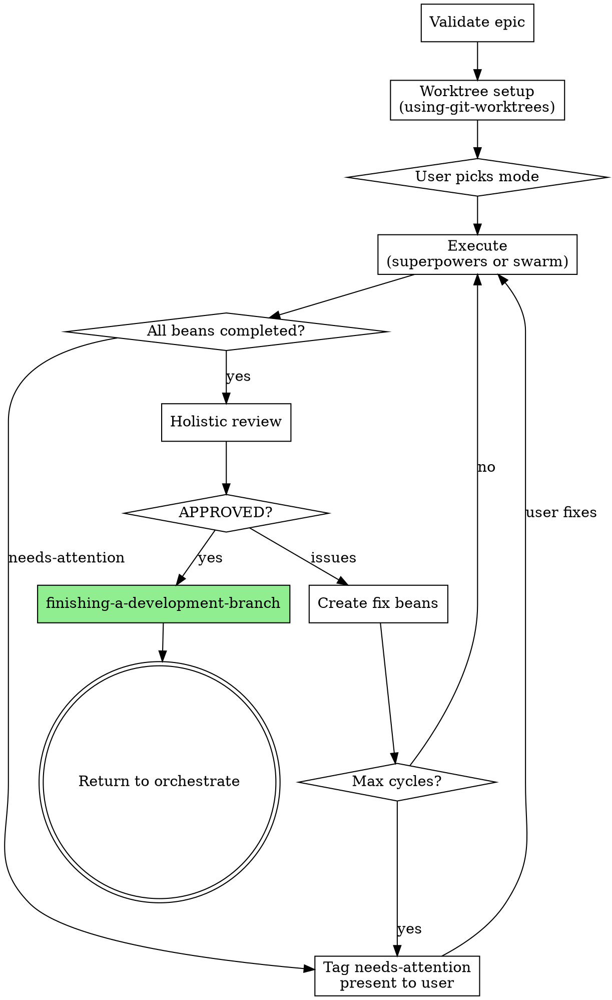
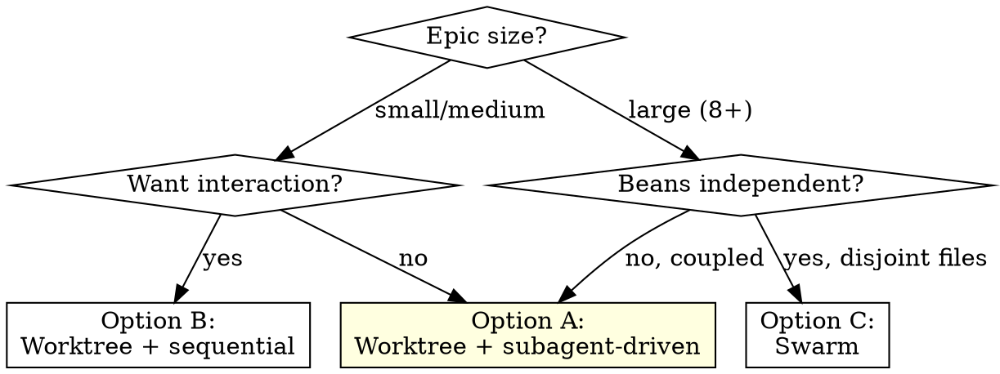
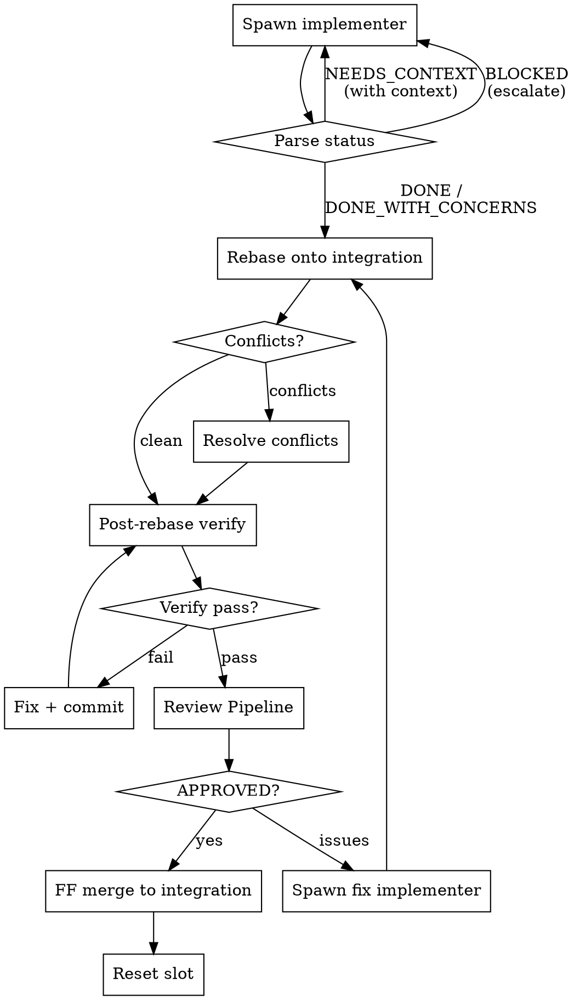
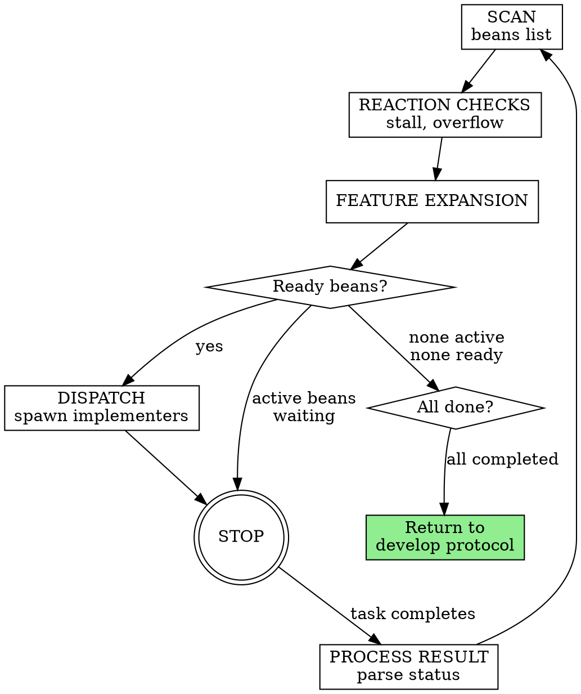

# Design: Develop phase redesign — superpowers composition with swarm option

**Date:** 2026-03-26
**Status:** Proposed

## Motivation

The current develop phase has three structural problems:

1. **Subagent nesting doesn't work.** The review coordinator is a subagent that spawns reviewer sub-subagents. In the subs variant, this creates two levels of nesting that empirically gets stuck.
2. **Merge conflicts are deferred to Cleanup.** The lead merges all worktrees at the end, burning context on conflict resolution it has no accumulated knowledge about. Conflicts pile up undetected.
3. **Two variants duplicate logic.** `develop-subs` and `develop-team` share ~90% of their code via a shared core file but maintain separate event handling, spawn config, and lifecycle management.

## Architecture

The develop phase composes existing superpowers skills with a thin wrapper that adds beans-based state tracking, stall detection, restart resilience, and holistic review.

`develop-subs/` and `develop-team/` are deleted. `develop/SKILL.md` becomes the entry point. It owns the worktree lifecycle, delegates execution to superpowers skills (patched to skip `finishing-a-development-branch`), runs holistic review as a quality gate, and calls `finishing-a-development-branch` itself after holistic review passes.

A separate swarm mode (`develop-swarm/SKILL.md`) provides parallel worktree-per-bean execution for large epics.

## Develop Protocol

Shared across all execution modes. This is the contract between develop and orchestrate.



```
develop(epic-id):
  1. VALIDATE
     beans show {epic-id} --json
     Confirm epic has child beans. If none → stop.

  2. WORKTREE SETUP
     Skill("superpowers:using-git-worktrees")
     → Creates isolated worktree for the epic
     → Safety checks, dependency install, baseline tests

  3. EXECUTION CHOICE
     User picks mode (or pre-configured via --execution flag):
       a. Worktree + subagent-driven (recommended)
       b. Worktree + sequential (interactive)
       c. Swarm (parallel, large epics)

  4. EXECUTE
     Delegate to chosen superpowers skill or develop-swarm.
     Superpowers skills are patched: finishing-a-development-branch
     is removed, worktree setup is skipped (already done).
     They run beans to completion and return control.

     If execution returns with needs-attention beans:
       Present to user, wait for guidance.
       When user fixes → back to step 4.

     If execution returns with incomplete beans (context exhaustion):
       Re-invoke the same skill — it picks up from bean state.

  5. HOLISTIC REVIEW
     All beans completed → spawn reviewer subagent with:
       - Full diff: git diff main...HEAD (in worktree)
       - All bean acceptance criteria from the epic
       - Instruction: check cross-bean consistency, duplicated
         utilities, naming drift, dead code, missing integration
     Verdict: APPROVED / ISSUES

  6. If ISSUES → create fix beans under epic → back to step 4
     If APPROVED → continue

  7. FINISH
     Skill("superpowers:finishing-a-development-branch")
     → User picks: merge, PR, keep, discard
     → Worktree cleanup

  8. RETURN to orchestrate → deliver phase
```

**Restart resilience:** On session restart, develop reads epic bean state (`beans list --parent {epic-id}`) and resumes at the appropriate step. Beans track all operational state — no session-scoped data to lose.

**Holistic review max cycles:** `max_review_cycles` from config. If exceeded → tag epic `needs-attention`, present to user.

## Execution Choices



### Option A: Worktree + subagent-driven (recommended)

```
Skill("superpowers:subagent-driven-development")
```

Delegates to superpowers, which handles:
- Fresh subagent per bean (implementer)
- Two-stage review (spec compliance, then code quality)
- Fix cycles on review failure

Note: `subagent-driven-development` executes beans sequentially (it explicitly prohibits parallel dispatch). Parallelism across epics comes from running multiple sessions in separate worktrees, not from intra-session parallelism.

Beans-patched: uses `beans update` for state instead of TodoWrite. Already patched via `patch-superpowers`.

Additional patch: remove `finishing-a-development-branch` invocation — develop owns this step.

### Option B: Worktree + sequential (interactive)

```
Skill("superpowers:executing-plans")
```

Lead executes each bean directly in the worktree. Human-in-loop between tasks. For small changes where the user wants to interact.

Same patches: beans instead of TodoWrite, finishing removed.

### Option C: Swarm (parallel, large epics)

```
Read("skills/develop-swarm/SKILL.md") → follow inline
```

Full parallel execution with worktree-per-bean and incremental merge. For large epics with genuinely independent beans where intra-epic parallelism matters. See "Swarm Mode" section below.

## Superpowers Patches

Applied via `patch-superpowers` alongside existing beans patches.

**Patch 1 (existing): Beans instead of TodoWrite for `executing-plans`**
Already applied. `executing-plans` uses `beans` CLI for state tracking.

**Patch 2 (new): Beans instead of TodoWrite for `subagent-driven-development`**
`subagent-driven-development` still uses TodoWrite throughout (task creation, completion tracking, the process flow). Patch to use `beans update --status in-progress` / `--status completed` instead. Same pattern as the existing `executing-plans` beans patch.

**Patch 3 (new): Remove finishing-a-development-branch and final code review from both skills**
`executing-plans` explicitly invokes finishing in Step 3. `subagent-driven-development` references it in the Integration section and dot diagram, and dispatches a "final code reviewer subagent for entire implementation" after all tasks. Patch both to return control to the caller instead. Develop owns finishing (after holistic review) and holistic review replaces the superpowers final code review.

**Patch 4 (new): Remove worktree setup from both skills**
Both list `using-git-worktrees` as "REQUIRED" in their Integration sections. When invoked from develop, the worktree already exists (develop creates it in protocol step 2). Patch the requirement note to: "If already in a worktree (detect by comparing `git rev-parse --git-dir` with `git rev-parse --git-common-dir` — they differ in a worktree), skip setup."

All patches are concrete search/replace operations specified in `patch-superpowers/SKILL.md` — the plan will define exact patch text.

## Stall Detection

Applies to all modes. The develop wrapper monitors bean state between execution turns.

For each `in-progress` bean:
- Read `spawned-at:{epoch}` tag
- If elapsed > `stall_timeout_min`: check `stall-respawns:{N}` tag
  - If N < `stall_max_respawns` → increment, respawn
  - If N >= `stall_max_respawns` → tag `needs-attention`

For superpowers modes (A, B): stall detection runs if the superpowers skill returns without completing all beans (session crash, context exhaustion). Develop re-invokes the superpowers skill — it picks up from bean state.

For swarm mode (C): stall detection is part of the orchestration loop.

## Commit Message Format

Conventional commits title + Previously/Now body + Bean trailer. Applies to all modes.

```
feat: add cancellation support to Store.Append

Previously Append took only beanID and event params, with no way to
cancel long-running writes from the fsnotify watcher.

Now Append takes context.Context as first param, allowing callers to
cancel via context. All Store consumers must update their call sites.

Bean: board-tm7m
```

- **Title:** Conventional commit prefix, imperative, max 70 chars
- **Body:** Previously/Now describing behavioral state change. When the clash hook fired for any file in this commit, the body MUST explain the interface change and impact on consumers.
- **Trailer:** `Bean: {BEAN_ID}`

## Implementer Status Protocol

The implementer's final output MUST start with a status keyword on its own line. Applies to swarm mode implementers. Superpowers modes use their own implementer protocol (DONE/DONE_WITH_CONCERNS/NEEDS_CONTEXT/BLOCKED from `subagent-driven-development`).

```
DONE
<diff + summary>

DONE_WITH_CONCERNS
<diff + summary>
<concerns section>

NEEDS_CONTEXT
<what's missing — be specific>

BLOCKED
<why — specific blocker>
  Escalation: provide context → split bean → tag needs-attention
```

## Holistic Review Procedure

Runs inside the develop protocol (step 5) when all beans are completed.

```
1. Collect full diff: git diff main...HEAD (in worktree)
2. Collect all bean acceptance criteria from the epic
3. Spawn reviewer subagent with:
   - The full diff
   - All acceptance criteria
   - Instruction: check for cross-bean inconsistencies, duplicated
     utilities, contradictory patterns, missing integration between
     components, dead code, naming drift
4. If ISSUES → create fix beans under epic → return to step 4
   of develop protocol (re-execute)
5. If APPROVED → proceed to finishing
```

Max cycles: `max_review_cycles`. Exceeded → tag `needs-attention`, present to user.

## Red Flags

Negative constraints. Agents follow these more reliably than positive procedures.

- **Never** dispatch an implementer without the full bean body
- **Never** dispatch without injecting curated codebase context
- **Never** ignore NEEDS_CONTEXT or BLOCKED — something must change before re-dispatch
- **Never** skip review even if the implementer self-reviewed
- **Never** force the same model to retry without changes — escalate model or split the bean
- **Never** let review cycles exceed `max_review_cycles` without escalating to the user
- **Never** invoke finishing-a-development-branch before holistic review passes
- **Never** dispatch coupled beans in parallel — if two ready beans edit the same files, serialize them (swarm mode)
- **Never** merge to integration without post-rebase verification passing (swarm mode)

---

## Swarm Mode

Specialized parallel execution for large epics. Used when option C is selected. Everything above (develop protocol, commit format, holistic review, red flags) applies. This section adds swarm-specific behavior.

### Architecture

| Role | Type | Lifecycle |
|---|---|---|
| Lead | Inline (main session) | Persistent — IS the session |
| Implementer | Background subagent | Stateless, per-bean |
| Reviewer | Background subagent | Stateless, per-bean |

No teams. No coordinator. The review coordinator is eliminated — its logic moves to a Review Pipeline procedure.

### Per-Bean Lifecycle



```
1. Spawn implementer in worktree → TDD, verify
   (writes .verification-output.txt), commit → done
2. Bash("scripts/rebase-worker.sh {worktree} {integration-branch}")
3. If exit 1 (conflicts) → resolve in worker worktree, git rebase --continue
4. Bash("scripts/post-rebase-verify.sh {worktree} '{verify-cmd}'")
   → overwrites .verification-output.txt
5. If exit 1 → commit fix in worker worktree, back to 4 (re-verify).
   If the fix changes the rebase base, back to 2.
6. Review Pipeline procedure → verdict
   (reviewer reads .verification-output.txt as evidence)
7. If ISSUES → spawn fix implementer, back to 2
8. Bash("scripts/merge-to-integration.sh {worktree} {integration-branch}")
9. Bash("scripts/reset-slot.sh {worktree} {integration-branch}")
```

Multiple beans run step 1 in parallel (up to `--workers`). Steps 2-9 are serial — one merge at a time. The lead processes one completed implementer per turn (STOP after each result). Queued results are processed in subsequent turns.

### Implementer Template Enrichments

The `develop-swarm/roles/implementer.md` adds beyond the current template:

**Before You Begin:** Encourage questions about requirements, approach, dependencies BEFORE starting work. Use NEEDS_CONTEXT if unclear.

**Self-Review Checklist:** Completeness, Quality, Discipline, Testing — structured self-assessment before DONE.

**When You're Stuck:** Specific signals for BLOCKED — reading files without progress, 5+ turns on one test, changes outside scope, contradictory criteria.

**Codebase Context:** Lead injects relevant files and parent contracts into `{CODEBASE_CONTEXT}`.

### Conflict Resolution

Everything needed is in git. When rebase produces conflicts:

1. Read conflict markers
2. `git log --oneline {integration-branch} -- {file}` to see what landed
3. `git show {sha}` for relevant commits — commit messages explain intent
4. Resolve
5. `git rebase --continue`

The clash hook (`clash-check.sh`) warns implementers about shared-file edits. The `crops-report-gate.sh` hook enforces decision reporting.

### Helper Scripts

Deterministic shell scripts for git operations. Full contracts (argument parsing, error handling, edge cases) specified in the implementation plan.

```
scripts/rebase-worker.sh {worktree} {integration-branch}
  → Exit 0 if clean, exit 1 if conflicts (prints conflicting files)

scripts/merge-to-integration.sh {worktree} {integration-branch}
  → Fast-forward merge. Exit 0 on success, exit 1 if not ff-able

scripts/detect-reviewers.sh {worktree} {integration-branch}
  → Diff worker vs integration, match extensions to checklists
  → Outputs one checklist name per line. Empty → baseline only

scripts/reset-slot.sh {worktree} {integration-branch}
  → git reset --hard, git clean -fd

scripts/post-rebase-verify.sh {worktree} {verify-cmd}
  → Run verification, write .verification-output.txt
  → Exit 0 all pass, exit 1 any fail
```

### Review Pipeline

Replaces the review coordinator. Procedure executed by the lead on demand.

```
1. DETECT REVIEWERS
   Bash("scripts/detect-reviewers.sh {worktree} {integration-branch}")
   → One reviewer per output line. Empty → baseline only
   → Cycle 2+: narrow to flagged-by tag reviewers only

2. BUILD PROMPTS
   Read("skills/develop-swarm/roles/reviewer.md")
   → Replace placeholders, inject language checklist
   → Append domain expert definition if available

3. SPAWN ALL REVIEWERS (single message)
   Agent(name, subagent_type, mode, run_in_background, max_turns, prompt)
   → Record task_ids

4. COLLECT RESULTS
   TaskOutput per task_id (block: true, timeout: 600000)
   → Parse first line: APPROVED / APPROVED WITH COMMENTS / ISSUES
   → Track reviewer name for flagged-by

5. AGGREGATE
   Any ISSUES → ISSUES + merged list, tag flagged-by
   Any COMMENTS → APPROVED_WITH_COMMENTS + suggestions, tag flagged-by
   All clean → APPROVED
```

### Orchestration Loop

Single loop, runs every turn (assess-and-act pattern).



```
1. SCAN — beans list --parent {epic-id} --json

2. REACTION CHECKS — stall detection, review overflow

3. FEATURE EXPANSION — promote todo features, complete when children done

4. DISPATCH — assign worktree slots, curate context, spawn implementers
   Model selection: 1-2 files → fast, 3+ files → standard, design → capable
   Launch ALL in one message. STOP.

5. PROCESS RESULTS — parse status protocol, execute lifecycle or escalate

6. COMPLETION — all done → return to develop protocol step 5 (holistic review)
```

### Bean Tag Schema

| Tag | Set by | Cleared by | Purpose |
|---|---|---|---|
| `role:implement` | Lead on dispatch | Lead on review start | Current phase |
| `role:review` | Lead on review start | Lead on verdict | Current phase |
| `role:review-fix-{cycle}` | Lead on ISSUES | Lead on next review | Fix cycle tracking |
| `bg-task:{task_id}` | Lead on spawn | Lead on result | Links to background task |
| `spawned-at:{epoch}` | Lead on spawn | Lead on result | Stall detection |
| `worktree-slot:{prefix}-{N}` | Lead on dispatch | Lead on completion | Worktree assignment |
| `flagged-by:{names}` | Review Pipeline | Lead on next cycle | Reviewer narrowing |
| `needs-attention` | Lead on escalation | User manually | Blocks automation |
| `stall-respawns:{N}` | Lead on stall | — | Escalation counter |

### Worktree Management

Delegates to `superpowers:using-git-worktrees` for directory selection and safety. Extends with multi-slot setup.

**Setup:** Integration worktree + N worker slots, project setup + baseline tests per worktree.

**Between beans:** `scripts/reset-slot.sh` + re-run project setup if deps changed.

**Cleanup:** Remove worker worktrees, delete scratch branches. Integration branch handoff to develop protocol step 7 (finishing).

---

## Configuration

`orchestrate.json` changes:

```json
{
  "develop": {
    "workers": 2,
    "max_review_cycles": 3,
    "max_impl_turns": 50,
    "stall_timeout_min": 15,
    "stall_max_respawns": 2
  }
}
```

Removed: `max_review_turns`, `max_total_turns`, `ci_max_retries`. Existing configs with removed keys are silently ignored.

The legacy `ralph` config key is migrated to `develop`. If both keys exist, `develop` takes precedence. `models.develop` is preserved for model selection.

**Orchestrate changes:** Remove `--max-total-turns` from the CLI flags table, the arg-building block in the DEVELOP section, and the config key parsing list (which reads `max_total_turns` from the legacy config block). Develop no longer accepts this flag — it runs inline and manages its own turn budget via the orchestration loop / superpowers delegation.

The `branch`-tagged bean concept is dropped. All beans use worktrees when `--workers > 1`. The `writing-plans` patch in `patch-superpowers` must also be updated: remove the `--tag worktree` / `--tag branch` isolation tag instructions and the worktree-vs-branch decision table.

## Files Changed

### Deleted
```
skills/develop-subs/                    → replaced by develop protocol + superpowers
skills/develop-team/                    → replaced by develop protocol + superpowers
skills/ralph/                           → replaced by develop-swarm, restructured
```

### Created
```
skills/develop-swarm/SKILL.md           → swarm orchestration loop + per-bean lifecycle
skills/develop-swarm/roles/implementer.md
skills/develop-swarm/roles/reviewer.md
skills/develop-swarm/roles/lead-procedures.md
skills/develop-swarm/checklists/*.md    → moved from skills/ralph/checklists/
scripts/rebase-worker.sh
scripts/merge-to-integration.sh
scripts/detect-reviewers.sh
scripts/reset-slot.sh
scripts/post-rebase-verify.sh
```

### Modified
```
skills/develop/SKILL.md                 → develop protocol + three execution choices
skills/patch-superpowers/SKILL.md       → add patches 2-4 (beans for subagent-driven, remove finishing + final review, skip worktree setup), remove stale --tag worktree/branch isolation table from writing-plans patch
skills/orchestrate/SKILL.md             → remove --max-total-turns flag, update develop invocation
orchestrate.json                        → migrate ralph key → develop, drop removed keys
docs/technical/SYSTEM.md                → update component descriptions
docs/technical/decisions/               → new ADR superseding 001 and 002
```

### Unchanged
```
hooks/clash-check.sh
hooks/crops-report-gate.sh
```

## What This Does NOT Change

- The four-phase lifecycle (discover → define → develop → deliver)
- Beans as the unit of work
- TDD enforcement via superpowers skills
- Decision reporting via crops report
- Holistic review via external providers
- Worktree isolation for parallel work
- Domain-expert reviewer selection (baseline fallback)
