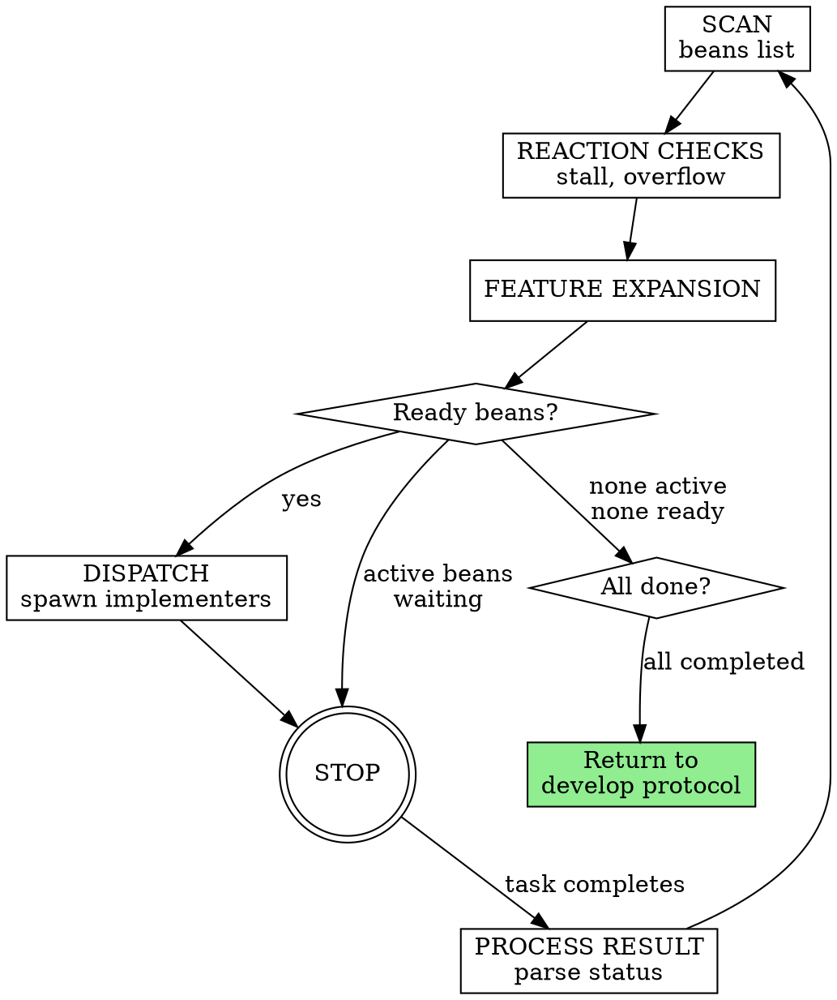
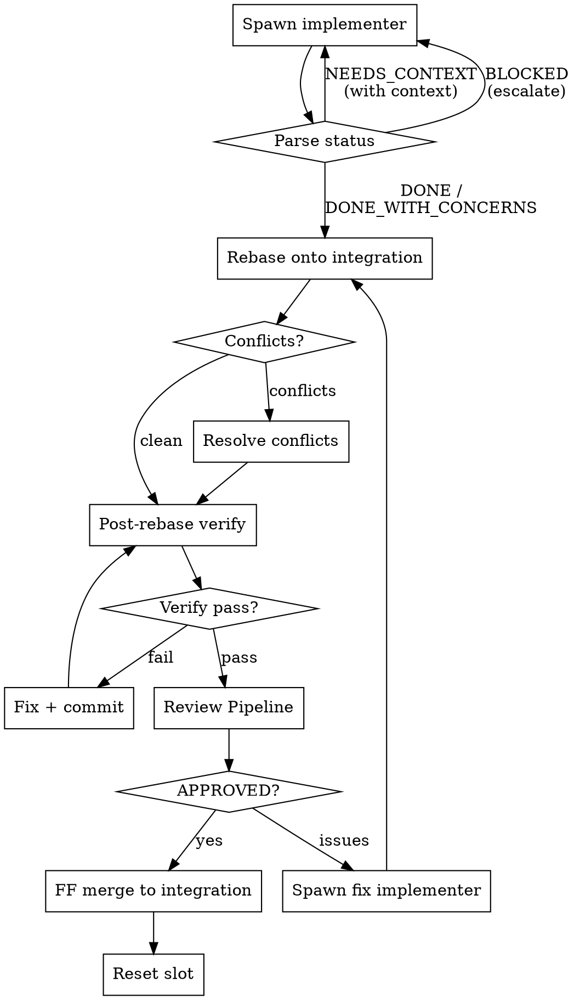
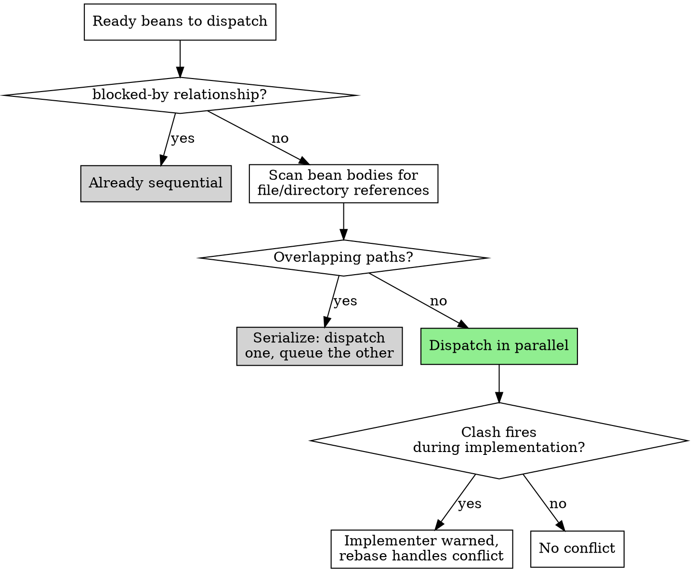

# Develop Swarm

Parallel worktree-per-bean execution for large epics. You ARE the lead — execute this inline. Do NOT invoke via the Skill tool.

ARGUMENTS: {ARGS}

## Architecture

| Role | Type | Lifecycle |
|---|---|---|
| Lead | Inline (main session) | Persistent — IS the session |
| Implementer | Background subagent | Stateless, per-bean |
| Reviewer | Background subagent | Stateless, per-bean |

No teams. No coordinator. The review coordinator is eliminated — its logic is in the Review Pipeline procedure (`skills/develop-swarm/roles/lead-procedures.md`).

## Configuration

Parse from `{ARGS}`:

| Flag | Default | Description |
|---|---|---|
| `--epic <id>` | **required** | The epic to develop |
| `--workers <N>` | from config | Parallel worker count |
| `--max-review-cycles <N>` | from config | Max review cycles before escalating |
| `--max-impl-turns <N>` | from config | Max agent turns per implementer |
| `--stall-timeout-min <N>` | from config | Minutes before stall detection fires |
| `--stall-max-respawns <N>` | from config | Max respawns before needs-attention |

### Config File

Read `orchestrate.json` (project root) if it exists. Extract from `develop {}` block first; if absent or empty, fall back to `ralph {}` block:
- workers, max_review_cycles, max_impl_turns, stall_timeout_min, stall_max_respawns
- `models.develop` — model for implementers and reviewers

CLI flags override config file values. Defaults when no config:
- workers: 2, max_review_cycles: 3, max_impl_turns: 50
- stall_timeout_min: 15, stall_max_respawns: 2

## Setup

### Compute Paths

```
EPIC_ID = parsed from --epic
MAIN_BEANS_PATH = absolute path to .beans/ in the main checkout
BEANS_ROOT = main checkout root (where .beans/ lives)
```

### Read Verify Command

Read `CLAUDE.md` in the project root. Extract the project's build, test, and lint commands. Compose a single `VERIFY_CMD` string that runs all verification steps. This command is passed to `scripts/post-rebase-verify.sh`.

### Worker Slot Setup

The develop-created worktree IS the integration target. Add N worker slots forked from it:

1. Identify the integration worktree (created by develop protocol step 2 via `using-git-worktrees`)
2. Determine the integration branch name from that worktree
3. For each worker slot (1 to `workers`):
   ```bash
   SLOT_NAME="{integration-branch}-worker-{N}"
   git worktree add "../{SLOT_NAME}" -b "{SLOT_NAME}" "{integration-branch}"
   ```
4. Run project setup (dependency install) in each slot
5. Run baseline verification in each slot to confirm clean state

## Orchestration Loop

Single loop, runs every turn (assess-and-act pattern).



### 1. SCAN

```bash
beans list --parent {EPIC_ID} --json
```

Categorize each bean:
- `completed` — done, skip
- `in-progress` with `bg-task:*` tag — active, waiting for result
- `in-progress` without `bg-task:*` tag — orphaned (stale session), treat as stalled
- `todo` with unresolved `blocked-by` — blocked, skip
- `todo` with no `blocked-by` or all blockers completed — ready to dispatch
- `needs-attention` — parked, skip

### 2. REACTION CHECKS

**Stall detection:** For each `in-progress` bean:
- Read `spawned-at:{epoch}` tag
- If elapsed > `stall_timeout_min` minutes: check `stall-respawns:{N}` tag
  - If N < `stall_max_respawns`: increment tag, respawn (clear `bg-task:*`, re-dispatch)
  - If N >= `stall_max_respawns`: tag `needs-attention`, stop automating this bean

**Review overflow:** For each bean with `role:review-fix-{cycle}` tag:
- If cycle >= `max_review_cycles`: tag `needs-attention`, stop automating

### 3. FEATURE EXPANSION

For beans of type `feature` (parent beans with children):
- If status is `todo` and all children are independent: promote children to ready
- If all children are `completed`: mark the feature bean as `completed`

### 4. DISPATCH

For each ready bean (up to available worker slots):

**a. Coupling Detection** — run the Coupling Detection Protocol (below) on all ready beans. Serialize coupled pairs.

**b. Worktree Slot Assignment:**
- If the bean already has a `worktree-slot:{prefix}-{N}` tag, reuse that slot
- If no tag, assign an available slot and tag the bean: `beans update {id} --tag worktree-slot:{slot-name}`

**c. Model Selection:**
- 1-2 files referenced in bean body: fast model (if configured in `models.develop`)
- 3+ files: standard model
- Design/architecture beans: capable model

**d. Context Curation:**
- Read the bean body: `beans show {id} --json`
- Read parent bean for shared contracts: `beans show {parent-id} --json`
- Read files referenced in the bean body
- Read files adjacent to referenced files (same package/directory)
- Compose `CODEBASE_CONTEXT` with these contents

**e. Build Implementer Prompt:**
```
Read("skills/develop-swarm/roles/implementer.md")
```
Replace placeholders:
- `{BEAN_ID}`, `{BEAN_TITLE}`, `{BEAN_BODY}` — from bean JSON
- `{WORKTREE_PATH}` — absolute path to the assigned worker slot
- `{MAIN_BEANS_PATH}` — absolute path to `.beans/` in main checkout
- `{BEANS_ROOT}` — main checkout root
- `{PARENT_ID}` — parent bean ID (for contract lookup)
- `{CODEBASE_CONTEXT}` — curated context from step d

**f. Spawn Implementer:**
```
Agent(
  name: "impl-{BEAN_ID}",
  subagent_type: "general-purpose",
  mode: "bypassPermissions",
  run_in_background: true,
  max_turns: max_impl_turns,
  prompt: <built prompt>
)
```

**g. Tag the bean:**
```bash
beans update {id} --status in-progress \
  --tag role:implement \
  --tag bg-task:{task_id} \
  --tag spawned-at:{epoch}
```

Launch ALL ready implementers in one message. Then STOP — wait for a result.

### 5. PROCESS RESULTS

When a background task completes, parse the implementer's output.

**First line determines status** (see Implementer Status Protocol below):

**DONE / DONE_WITH_CONCERNS:** Execute the Per-Bean Lifecycle (steps 2-9 below).

**NEEDS_CONTEXT:**
- Read what the implementer needs
- Provide the missing context (read files, check beans, etc.)
- Re-dispatch with enriched `CODEBASE_CONTEXT`
- If context cannot be determined: tag `needs-attention`

**BLOCKED:**
- Read the specific blocker
- Escalation path: provide context to unblock, split the bean, or tag `needs-attention`
- Never re-dispatch without changing something

After processing one result: clear `bg-task:*` and `spawned-at:*` tags from the bean. Then loop back to SCAN.

<HARD-GATE>
STOP after processing each result. One result per turn. Queued results are processed in subsequent turns. This prevents context explosion from processing multiple results at once.
</HARD-GATE>

### 6. COMPLETION

When SCAN shows all beans are `completed` (or `needs-attention`):
- If any `needs-attention`: return to develop protocol with needs-attention state
- If all `completed`: return to develop protocol step 5 (holistic review)

Read("skills/develop-swarm/roles/lead-procedures.md") → follow the Cleanup procedure before returning.

## Per-Bean Lifecycle

Steps 2-9 execute after an implementer returns DONE or DONE_WITH_CONCERNS. Steps 2-9 are serial — one merge at a time.



### Step 1: Spawn Implementer
Handled by the Orchestration Loop DISPATCH phase (above).

### Step 2: Rebase onto Integration
```bash
Bash("scripts/rebase-worker.sh {worktree} {integration-branch}")
```
- Exit 0: clean rebase, proceed to step 4
- Exit 1: conflicts, proceed to step 3

### Step 3: Resolve Conflicts
Read("skills/develop-swarm/roles/lead-procedures.md") → follow the Conflict Resolution procedure:

1. Read conflict markers in each file (script prints conflicting file names)
2. `git log --oneline {integration-branch} -- {file}` to see what landed
3. `git show {sha}` for relevant commits — commit messages explain intent
4. Resolve the conflicts in the worker worktree
5. `git rebase --continue`

### Step 4: Post-Rebase Verify
```bash
Bash("scripts/post-rebase-verify.sh {worktree} '{VERIFY_CMD}'")
```
- Overwrites `.verification-output.txt` in the worker worktree
- Exit 0: all pass, proceed to step 6
- Exit 1: verification failed, proceed to step 5

### Step 5: Fix Verification Failures
- Read `.verification-output.txt` to identify failures
- Fix the failures in the worker worktree
- Commit the fix
- If the fix changes the rebase base (touches files that were rebased): go back to step 2
- Otherwise: go back to step 4 (re-verify)

### Step 6: Review Pipeline
```
Read("skills/develop-swarm/roles/lead-procedures.md") → follow the Review Pipeline procedure
```

Update bean tags:
```bash
beans update {id} --tag role:review --untag role:implement
```

The Review Pipeline procedure handles:
1. Detect reviewers: `Bash("scripts/detect-reviewers.sh {worktree} {integration-branch}")`
2. Build reviewer prompts from `Read("skills/develop-swarm/roles/reviewer.md")`
3. Spawn all reviewers as background subagents
4. Collect results via TaskOutput
5. Aggregate verdict: APPROVED / APPROVED_WITH_COMMENTS / ISSUES

### Step 7: Handle Review Verdict

**APPROVED / APPROVED_WITH_COMMENTS:** Proceed to step 8.

**ISSUES:**
- Tag the bean: `beans update {id} --tag role:review-fix-{cycle}`
- Check if cycle >= `max_review_cycles`: if so, tag `needs-attention` and stop
- Spawn a fix implementer with:
  - The original bean body
  - The review issues as `{PREVIOUS_ISSUES}`
  - The `superpowers:receiving-code-review` skill instruction
- When fix implementer returns: go back to step 2 (rebase again)

### Step 8: Fast-Forward Merge to Integration
```bash
Bash("scripts/merge-to-integration.sh {worktree} {integration-branch}")
```
- Exit 0: merged, proceed to step 9
- Exit 1: not fast-forwardable — this means something merged to integration after our rebase. Go back to step 2

### Step 9: Reset Slot
```bash
Bash("scripts/reset-slot.sh {worktree} {integration-branch}")
```

Update bean state:
```bash
beans update {id} --status completed \
  --untag role:review \
  --untag worktree-slot:{slot-name} \
  --untag bg-task:{task_id} \
  --untag spawned-at:{epoch}
```

The slot is now free for the next bean.

## Coupling Detection Protocol

Defense-in-depth approach to preventing parallel dispatch of coupled beans.



```
COUPLING DETECTION (before parallel dispatch)

For each pair of ready beans:

1. DEPENDENCY CHECK
   beans show {id} --json → check blocked-by
   If either bean blocks the other → already sequential, skip

2. PATH OVERLAP CHECK
   Extract file/directory references from both bean bodies:
   - Explicit paths (e.g., "internal/activity/store.go")
   - Package/directory names (e.g., "internal/activity")
   - Shared interface references (e.g., "Store interface")
   If any overlap → serialize: dispatch one now, queue the other

3. DISPATCH
   No overlap detected → safe to dispatch in parallel
   Clash hook provides runtime safety net — if the heuristic
   missed a coupling, the implementer is warned on file write
   and the rebase step resolves conflicts
```

## Conflict Resolution

When rebase produces conflicts, everything needed is in git:

1. Read conflict markers in each file
2. `git log --oneline {integration-branch} -- {file}` to see what landed
3. `git show {sha}` for relevant commits — commit messages explain intent
4. Resolve
5. `git rebase --continue`

The clash hook (`clash-check.sh`) warns implementers about shared-file edits. The `crops-report-gate.sh` hook enforces decision reporting.

## Implementer Status Protocol

The implementer's final output MUST start with a status keyword on its own line:

```
DONE
<diff + summary>

DONE_WITH_CONCERNS
<diff + summary>
<concerns section>

NEEDS_CONTEXT
<what's missing — be specific>

BLOCKED
<why — specific blocker>
  Escalation: provide context → split bean → tag needs-attention
```

## Swarm Restart Rules

On session restart, the lead re-derives state from beans and resumes. No session-scoped data to lose.

1. **Clear stale `bg-task:*` tags** — old task IDs do not exist in the new session. For every bean with a `bg-task:*` tag:
   ```bash
   beans update {id} --untag bg-task:{old_task_id}
   ```

2. **Preserve `worktree-slot:*` tags** — slot assignments are durable. Beans keep their worktrees across restarts.

3. **On dispatch:** if the bean already has a `worktree-slot` tag, reuse that slot (do NOT reset). If no tag, assign an available slot.

4. **Stall detection handles respawning naturally** — orphaned `role:implement`/`role:review` beans without `bg-task:*` tags trigger respawn after the stall timeout fires.

5. **Integration worktree is still valid** — merged beans stay merged. No rollback.

6. **Fresh implementers check `git log --oneline`** in the worktree to find and continue prior work. They do not start from scratch if commits exist.

## Bean Tag Schema

| Tag | Set by | Cleared by | Purpose |
|---|---|---|---|
| `role:implement` | Lead on dispatch | Lead on review start | Current phase |
| `role:review` | Lead on review start | Lead on verdict | Current phase |
| `role:review-fix-{cycle}` | Lead on ISSUES | Lead on next review | Fix cycle tracking |
| `bg-task:{task_id}` | Lead on spawn | Lead on result | Links to background task |
| `spawned-at:{epoch}` | Lead on spawn | Lead on result | Stall detection |
| `worktree-slot:{prefix}-{N}` | Lead on dispatch | Lead after merge + reset (steps 8-9) | Worktree assignment. Preserved during implementation, review, fix cycles, and restart. Cleared only when bean is completed and slot freed. |
| `flagged-by:{names}` | Review Pipeline | Lead on next cycle | Tracks which reviewers flagged issues (diagnostic) |
| `needs-attention` | Lead on escalation | User manually | Blocks automation |
| `stall-respawns:{N}` | Lead on stall | — | Escalation counter |

## Red Flags

Negative constraints. Follow these more reliably than positive procedures.

- **Never** dispatch an implementer without the full bean body
- **Never** dispatch without injecting curated codebase context
- **Never** ignore NEEDS_CONTEXT or BLOCKED — something must change before re-dispatch
- **Never** skip review even if the implementer self-reviewed
- **Never** force the same model to retry without changes — escalate model or split the bean
- **Never** let review cycles exceed `max_review_cycles` without escalating to the user
- **Never** dispatch coupled beans in parallel — if two ready beans edit the same files, serialize them
- **Never** merge to integration without post-rebase verification passing
- **Never** invoke finishing-a-development-branch before holistic review passes
- **Never** implement beans yourself — delegate only
- **Never** resume a previous implementer agent — always spawn fresh with full context
- **Never** process more than one completed result per turn — STOP after each
