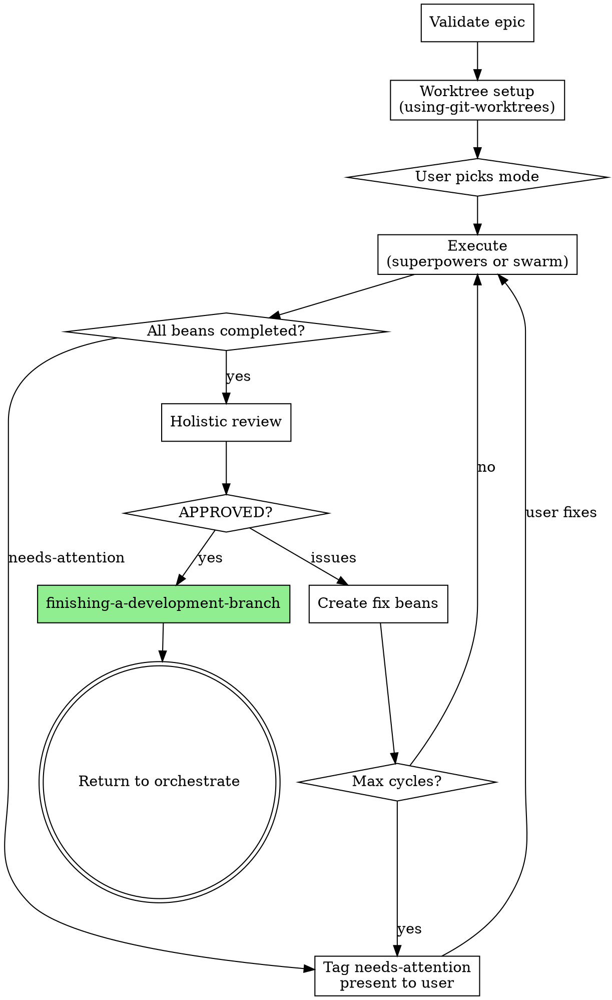

# Develop

Execute an implementation plan by delegating to superpowers or swarm, handling failures, running holistic review, and finishing the branch.

ARGUMENTS: {ARGS}

## Configuration

Parse from `{ARGS}`:

| Flag | Default | Description |
|---|---|---|
| `--epic <id>` | **required** | The epic to develop |
| `--execution <mode>` | from config | Execution mode: `subagent`, `sequential`, or `swarm` |
| `--workers <N>` | from config | Parallel worker count (swarm mode) |
| `--max-review-cycles <N>` | from config | Max holistic review cycles before escalating |
| `--max-impl-turns <N>` | from config | Max agent turns per implementer |
| `--stall-timeout-min <N>` | from config | Minutes before stall detection fires |
| `--stall-max-respawns <N>` | from config | Max respawns before needs-attention |

### Config File

Read `orchestrate.json` (project root) if it exists. Extract from `develop {}` block first; if absent or empty, fall back to `ralph {}` block:
- workers, max_review_cycles, max_impl_turns, stall_timeout_min, stall_max_respawns
- `models.develop` — model for implementers and reviewers
- `providers.develop_holistic` — provider list for holistic review
- `develop.execution` — pre-configured execution mode

CLI flags override config file values. Defaults when no config:
- workers: 2, max_review_cycles: 3, max_impl_turns: 50
- stall_timeout_min: 15, stall_max_respawns: 2

## Develop Protocol



```
develop(epic-id):
  1. VALIDATE
     beans show {epic-id} --json
     Confirm epic has child beans. If none → stop.

  2. WORKTREE SETUP
     Skill("superpowers:using-git-worktrees")
     → Creates isolated worktree for the epic
     → Safety checks, dependency install, baseline tests

  3. EXECUTION CHOICE
     User picks mode (or pre-configured via `--execution` flag
     or `develop.execution` in orchestrate.json):
       a. Worktree + subagent-driven (recommended, `--execution subagent`)
       b. Worktree + sequential (interactive, `--execution sequential`)
       c. Swarm (parallel, `--execution swarm`)

  4. EXECUTE
     Delegate to chosen superpowers skill or develop-swarm.
     Superpowers skills are patched: finishing-a-development-branch
     is removed, worktree setup is skipped (already done).
     They run beans to completion and return control.

     If execution returns with needs-attention beans:
       Present to user, wait for guidance.
       When user fixes → back to step 4.

     If execution returns with incomplete beans (context exhaustion):
       Re-invoke the same skill — it picks up from bean state.

  5. HOLISTIC REVIEW
     All beans completed → dispatch reviewer via provider-dispatch
     procedure (same mechanism as all other provider calls).
     If no providers available, spawn reviewer subagent as fallback.
     Provide:
       - Full diff: git diff main...HEAD (in worktree)
       - All bean acceptance criteria from the epic
       - Instruction: check cross-bean consistency, duplicated
         utilities, naming drift, dead code, missing integration
     Verdict: APPROVED / ISSUES
     Max cycles: max_review_cycles. Exceeded → needs-attention.

  6. If ISSUES → create fix beans under epic → back to step 4
     If APPROVED → continue

  7. FINISH
     Skill("superpowers:finishing-a-development-branch")
     → User picks: merge, PR, keep, discard
     → Worktree cleanup

  8. RETURN to orchestrate with terminal state:
     - merge/PR → orchestrate proceeds to deliver
     - keep → orchestrate proceeds to deliver (branch preserved)
     - discard → orchestrate stops, epic tagged abandoned
     - needs-attention (from step 4/5) → orchestrate waits for user
```

## Steps

### Step 1: Validate Epic

```bash
beans show <epic-id> --json
```

Confirm it exists and has child beans. If no child beans, stop: "No beans found for this epic. Run `/fiddle:define` first."

### Step 2: Worktree Setup

```
Skill("superpowers:using-git-worktrees")
```

Creates an isolated worktree for the epic. Runs safety checks, dependency install, and baseline tests. All subsequent execution happens in this worktree.

### Step 3: Execution Choice

Check for `--execution` flag or `develop.execution` in config. If set, use that value without prompting. If not set, present options and **wait for the user to pick**:

```
"Beans are ready. Pick an execution mode (1-3):

1. Subagent-driven (recommended) — fresh subagent per bean, two-stage review, sequential
2. Sequential (interactive) — human-in-loop, you guide each bean
3. Swarm (parallel) — worktree-per-bean, for large epics with independent beans"
```

<HARD-GATE>
Do NOT proceed until the user has explicitly chosen 1, 2, or 3. Do NOT assume a default. Do NOT auto-select. Wait for their response.
</HARD-GATE>

### Step 4: Execute

Delegate to the chosen execution mode. All three modes are patched: `finishing-a-development-branch` is removed (develop owns this step after holistic review), and worktree setup is skipped (already done in step 2).

#### Option A: Subagent-driven (`--execution subagent`)

```
Skill("superpowers:subagent-driven-development")
```

Delegates to superpowers, which handles:
- Fresh subagent per bean (implementer)
- Two-stage review (spec compliance, then code quality)
- Fix cycles on review failure

Beans-patched: uses `beans update` for state instead of TodoWrite. Sequential execution — one bean at a time. Parallelism across epics comes from running multiple sessions in separate worktrees, not from intra-session parallelism.

When all beans are completed or parked, proceed to step 5.

#### Option B: Sequential (`--execution sequential`)

```
Skill("superpowers:executing-plans")
```

Lead executes each bean directly in the worktree. Human-in-loop between tasks. For small changes where the user wants to interact.

Same patches: beans instead of TodoWrite, finishing removed.

When all beans are completed or parked, proceed to step 5.

#### Option C: Swarm (`--execution swarm`)

```
Read("skills/develop-swarm/SKILL.md") → follow inline
```

Full parallel execution with worktree-per-bean and incremental merge. For large epics with genuinely independent beans. You ARE the lead — read the swarm SKILL.md and execute it inline in this session. Do NOT invoke via the Skill tool — it has `disable-model-invocation`.

Pass these args to the swarm instructions:
```
--epic <epic-id> --workers <workers> --max-review-cycles <max_review_cycles>
--max-impl-turns <max_impl_turns> --stall-timeout-min <stall_timeout_min>
--stall-max-respawns <stall_max_respawns>
```

When the swarm returns (all beans completed or needs-attention), proceed to step 5.

### Step 5: Handle Execution Result

Check bean state after execution returns:

**All beans completed:** Proceed to Step 6 (Holistic Review).

**Beans parked with `needs-attention`:**

Present to user:
```
"Waiting on your input for N beans:
- <bean-id>: <title> — <reason>
- ...

You can: fix the issue and remove needs-attention tag, scrub the bean, or rework the scope."
```

Wait for the user to address the parked beans. When they respond, loop back to Step 4 — re-invoke the same execution mode. It discovers current state from `beans list`.

**Incomplete beans (context exhaustion):** Re-invoke the same execution mode. It picks up from bean state.

### Step 6: Holistic Review

When all epic beans are `completed` (none in `todo` or `in-progress`):

1. **Dispatch reviewer via provider-dispatch.** Read `skills/develop-swarm/roles/provider-dispatch.md` for the dispatch procedure. For each configured holistic review provider:

   ```bash
   DIFF_FILE=$(mktemp /tmp/diff-XXXX.txt)
   git diff main...HEAD > "$DIFF_FILE"

   hooks/dispatch-provider.sh <provider> \
     --role "Holistic reviewer" \
     --topic "Epic holistic review for <epic-id>" \
     --diff-file "$DIFF_FILE" \
     --instructions "Review the full diff for cross-bean consistency, duplicated utilities, naming drift, dead code, and missing integration. Compare against the epic's acceptance criteria."
   ```

   Fire all providers in parallel (`run_in_background: true`). Collect results in **unattended** mode (first-past-the-post).

2. **Fallback: subagent review.** If no providers are configured or available, spawn a reviewer subagent as fallback:

   ```
   Agent(
     name: "holistic-reviewer",
     subagent_type: "general-purpose",
     mode: "bypassPermissions",
     run_in_background: true,
     max_turns: 30,
     prompt: <full diff + acceptance criteria + review instructions>
   )
   ```

   Provide:
   - Full diff: `git diff main...HEAD` (in worktree)
   - All bean acceptance criteria from the epic
   - Instruction: check cross-bean consistency, duplicated utilities, naming drift, dead code, missing integration

3. **Verdict:** APPROVED or ISSUES.

4. **If ISSUES:** Create fix beans under the epic for each issue found. Loop back to Step 4 — re-invoke the same execution mode. It discovers the new fix beans via `beans list`.

5. **If APPROVED:** Proceed to Step 7.

6. **Max cycles:** If review cycles exceed `max_review_cycles`, tag the epic `needs-attention` and present to the user instead of looping.

### Step 7: Finish

```
Skill("superpowers:finishing-a-development-branch")
```

User picks: merge, PR, keep, or discard. Worktree cleanup happens here.

### Step 8: Return to Orchestrate

Terminal states:
- **merge/PR** → orchestrate proceeds to deliver
- **keep** → orchestrate proceeds to deliver (branch preserved)
- **discard** → orchestrate stops, epic tagged abandoned
- **needs-attention** (from step 5/6) → orchestrate waits for user

## Stall Detection

Applies to all modes. The develop wrapper monitors bean state between execution turns.

For superpowers modes (A, B): if the superpowers skill returns without completing all beans (session crash, context exhaustion), develop re-invokes the same skill. It picks up from bean state.

For swarm mode (C): stall detection is part of the swarm orchestration loop (see `develop-swarm/SKILL.md`).

For each `in-progress` bean:
- Read `spawned-at:{epoch}` tag
- If elapsed > `stall_timeout_min` minutes: check `stall-respawns:{N}` tag
  - If N < `stall_max_respawns`: increment tag, respawn
  - If N >= `stall_max_respawns`: tag `needs-attention`, stop automating this bean

## Red Flags

Negative constraints. Agents follow these more reliably than positive procedures.

- **Never** dispatch an implementer without the full bean body
- **Never** dispatch without injecting curated codebase context
- **Never** ignore NEEDS_CONTEXT or BLOCKED — something must change before re-dispatch
- **Never** skip review even if the implementer self-reviewed
- **Never** force the same model to retry without changes — escalate model or split the bean
- **Never** let review cycles exceed `max_review_cycles` without escalating to the user
- **Never** invoke finishing-a-development-branch before holistic review passes
- **Never** dispatch coupled beans in parallel — if two ready beans edit the same files, serialize them (swarm mode)
- **Never** merge to integration without post-rebase verification passing (swarm mode)

## Restart Resilience

On session restart, develop re-derives state from beans and resumes — no session-scoped data to lose.
